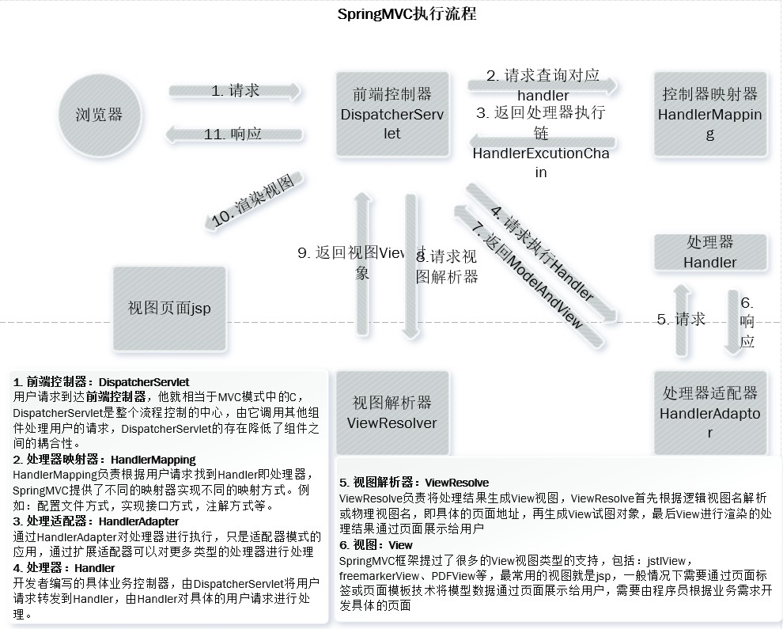

# spring mvc demo

## 1. spring web 集成

### 1.1 应用上下文获取方式

Spring 应用上下文对象是通过new ClassPathXmlApplicationContext(Spring 配置文件) 方式获取的，但是每次从容器中获取Bean都需要编写 `new ClassPathXmlApplication(Spring 配置文件)`,导致配置文件多次加载，上下文对象多次创建。

在Web项目中，通过监听器，在Web应用启动时加载Spring配置文件，创建Spring上下文对象，存储到servlet上下文对象中，即可在任意位置从域中获取spring应用上下文对象

spring 提供了一个监听器ContextLoaderListener就是对上述功能的对象，该监听器内部加载Spring配置文件，创建应用上下文对象，并存储到ServletContext域中，提供了一个客户端工具，WebApplicationContextUtils供使用者获得应用上下文对象。

### 1.2 具体配置

- Spring集成Web坐标

    ```xml
    <dependency>
        <groupId>org.springframework</groupId>
        <artifactId>spring-web</artifactId>
        <version>5.0.5.RELEASE</version>
    </dependency>
    ```

- 配置ContextLoaderListener监听器

    ```xml
    <!--  全局参数  -->
    <context-param>    
        <param-name>contextConfigLocation</param-name>    
        <param-value>classpath:applicationContext.xml</param-value></context-param>
    
    <!--  spring 监听器  -->
    <listener>    
        <listener-class>
    		org.springframework.web.context.ContextLoaderListener
        </listener-class>
    </listener>
    ```

- 获取上下文对象

    ```java
    ApplicationContext app = WebApplicationUtils.getWebApplicationContext(servletContext);
    Object obj = app.getBean("id");
    ```


## 2. Spring MVC

### 2.1 概述

Spring MVC 是一种基于 Java 的实现 MVC 设计模型的请求驱动类型的轻量级框架， 基于 SpringFramework 的后续产品，已融合在 Spring Web Flow 中。

### 2.2 Spring MVC组件

#### 2.2.1 Spring MVC 执行流程



1. 用户发送请求至前端控制器 DispatcherServlet
2. DispatcherServlet收到请求调用HandlerMapping处理器映射器
3. 处理器映射器找到具体的处理器（可以根据xml配置，注解进行查找），生成处理器对象以及处理器拦截器，一并返回给DispatcherServlet
4. DispatcherServlet 调用HandlerAdapter处理器适配器
5. HandlerAdapter经过适配调用具体的处理器(Controller(后端控制器))
6. Controller执行完成返回ModelAndView
7. HandlerAdapter将Controller执行结果ModelAndView返回给DispatcherServlet
8. DispatcherServlet将ModelAndView传给ViewReslover视图解析器
9. ViewReslover解析后返回具体View
10. DispatcherServket根据View进行视图渲染
11. DispatcherServlet响应用户


#### 2.2.2 Spring 注解

| 注解            | 作用                                        | 位置                                                         | 属性                                                         |
| --------------- | ------------------------------------------- | ------------------------------------------------------------ | ------------------------------------------------------------ |
| @RequestMapping | 用于建立请求URL和处理请求方法之间的对应关系 | 类上：请求URL的第一级访问目录，如果无，则默认为应用根目录。<br />方法上：请求URL的第二级访问目录，与类上使用的`@ResquestMapping`标注的一级目录一起组成访问虚拟路径 | value：用于指定请求的URL，它和path属性的作用是一致的<br />method：用于指定请求的方式<br />param：用于指定限制请求参数的条件，它支持简单的表达式，要求请i去参数的key和value必须配置的一模一样 |

- 引入命名空间和约束

    命名空间

    ```
    xmlns:mvc="http://www.springframework.org/schema/mvc"
        xmlns:context="http://www.springframework.org/schema/context"
    ```

    约束地址

    ```http
    http://www.springframework.org/schema/mvc
    http://www.springframework.org/schema/mvc/spring-mvc.xsd
    http://www.springframework.org/schema/context
    http://www.springframework.org/schema/context/spring-context.xsd
    ```

- 组件扫描

    Spring MVC 基于 Spring，默认组件配置都是`DispatcherServlet.properties`配置文件中配置的，该配置文件地址 `org/springframework/web/servlet/DispatcherServlet.properties`配置了默认的视图解析器，

    ```properties
    org.springframework.web.servlet.ViewResolver=org.springframework.web.servlet.view.InternalResourceViewResolver
    ```

    其默认配置如下

    ```ini
    REDIRECT_URL_PREFIX = "redirect:"	--重定向前缀
    FORWARD_URL_PREFIX = "forward:"		--转发前缀（默认值）
    prefix = "";	--视图名称前缀
    suffix = "";	--视图名称后缀
    ```

- 视图解析器

    通过属性注入方式修改视图的前后缀

    ```xml
    <!--配置内部资源视图解析器-->
    
    ```

    